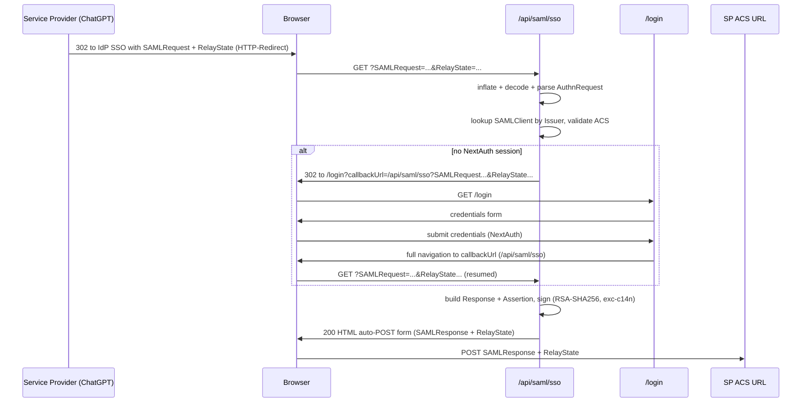
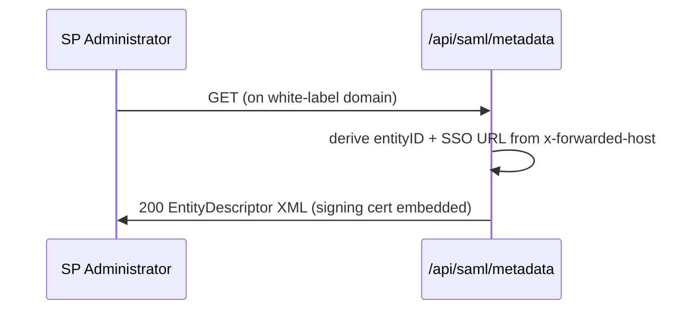

# Design Document: SAML 2.0 Identity Provider

## Overview

This feature adds a **SAML 2.0 Identity Provider (IdP)** to the Mailbox application, running **alongside** the existing OIDC provider. External Service Providers (SPs) — chiefly ChatGPT Enterprise/Business custom SAML connections, but also any standards-compliant SAML 2.0 SP — can authenticate Mailbox users through "Sign in with Mailbox".

The design mirrors the established OIDC architecture so the two providers share patterns without sharing state:

| Concern | OIDC (existing) | SAML (this feature) |
| --- | --- | --- |
| Key material | `lib/oidc/keys.js`, env base64 PEM | `lib/saml/keys.js`, env base64 PEM (distinct vars) |
| Protocol utilities | `lib/oidc/*` | `lib/saml/*` |
| Protocol routes | `app/api/oidc/*`, `app/.well-known/*` | `app/api/saml/*` |
| Client records | `OAuthClient` model + `app/admin/oauth-clients` | `SAMLClient` model + `app/admin/saml-clients` |
| Host derivation | `getIssuerFromHeaders(headers)` | reused / `getEntityIdFromHeaders(headers)` |
| Session | NextAuth credentials session | same |
| Key gen / setup | `scripts/generate-rsa-keys.js`, VPS setup | `scripts/generate-saml-cert.js`, VPS setup |

The OIDC code (`lib/oidc/`, `app/api/oidc/`, `app/.well-known/`) is **not modified**. The only shared touch points are the login page (already callbackUrl-aware) and the setup script (gains a SAML cert step).

Because the app runs behind a Caddy reverse proxy that presents it as `127.0.0.1:3000`, every externally visible URL (entityID, SSO endpoint, metadata URL, login redirect origin) MUST be derived from the `x-forwarded-host` / `host` headers, never from `request.url`. This is the same multi-domain (white-label) requirement OIDC already satisfies, so each custom domain acts as its own independent SAML IdP.

### Research Summary: SAML Library Choice

The IdP must emit a signed `<samlp:Response>` whose `entityID`, `Destination`, `Issuer`, and `Audience` vary **per request host**, with a signature using **RSA-SHA256**, **exclusive canonicalization** (`xml-exc-c14n#`), **SHA-256** digest, an embedded **X509** certificate in `KeyInfo`, and the `<Signature>` placed at the SAML-schema-mandated position so strict SPs (ChatGPT/WorkOS) accept it.

Two viable approaches were evaluated:

1. **`samlify`** ([tngan/samlify](https://github.com/tngan/samlify)) — a maintained Node SAML library that supports the IdP role (`createLoginResponse`) and RSA-SHA256 signing. However:
   - The IdP `entityID` and metadata are fixed at IdP-instance construction time. Supporting a per-request host-derived `entityID` requires constructing a fresh IdP (and SP) instance on every request, which fights the library's design.
   - It requires a separate schema-validation plugin (e.g. `@authenio/samlify-node-xmllint`) that pulls native/wasm dependencies and is a known source of friction under PM2/production Node.
   - Fine control over exact `<Signature>` placement and namespace prefixes (which ChatGPT/WorkOS are strict about) is achieved through template overrides that are awkward to maintain.

2. **`xml-crypto` + `xmlbuilder2`** — `xml-crypto` ([node-saml/xml-crypto](https://github.com/node-saml/xml-crypto), actively maintained) gives full control over signature algorithm, canonicalization, digest, reference transforms, `KeyInfo`/`X509Data`, and signature insertion location. `xmlbuilder2` deterministically constructs the response/assertion/metadata XML. Both are pure-JS, installable via npm, and run on Node 20.

**Decision: use `xml-crypto` + `xmlbuilder2`.** The deciding factors are (a) the per-request host-derived `entityID`/endpoints requirement, which is trivial when we build XML ourselves but awkward with `samlify`'s instance model, and (b) the need for precise signature placement and canonicalization to satisfy ChatGPT/WorkOS. This also matches the existing codebase philosophy: OIDC was built from primitives (`crypto`, `jsonwebtoken`) rather than a heavyweight framework, keeping multi-domain host derivation fully under our control. The AuthnRequest inflate/parse path uses Node's built-in `zlib` plus a lightweight XML parser already pulled in transitively by `xml-crypto` (`@xmldom/xmldom`), avoiding an extra dependency.

New dependencies: `xml-crypto`, `xmlbuilder2` (and `@xmldom/xmldom`, a transitive dep of `xml-crypto`, used directly for parsing).

## Architecture

### Request Flows

SP-initiated SSO (the primary flow):



Metadata retrieval:



### Module Layout

```
lib/saml/
  keys.js            # cert/key loading from env, base64 DER export, host helper
  authn-request.js   # decode/inflate + parse AuthnRequest -> structured object
  metadata.js        # build IDP EntityDescriptor XML for a given entityID
  response.js        # build Response + Assertion XML (unsigned)
  sign.js            # XML signature over the assertion (xml-crypto)
  acs.js             # SP lookup + ACS validation logic (pure)
  attributes.js      # map a User -> SAML attribute list (pure)

app/api/saml/
  metadata/route.js  # GET metadata
  sso/route.js       # GET + POST AuthnRequest handling + response generation

app/api/admin/saml-clients/
  route.js           # GET list, POST create
  [id]/route.js      # GET, PATCH, DELETE

app/admin/saml-clients/page.js   # admin UI (mirrors oauth-clients page)

lib/models/SAMLClient.js          # Mongoose model

scripts/generate-saml-cert.js     # self-signed cert + RSA key -> base64 env values
```

### Host Derivation

`lib/saml/keys.js` exposes `getEntityIdFromHeaders(headers)` following the exact pattern of `getIssuerFromHeaders` in `lib/oidc/keys.js`:

- host = `x-forwarded-host` || `host`
- proto = `x-forwarded-proto` || (`production` ? `https` : `http`); production always emits `https` for outbound IdP URLs
- returns origin `${proto}://${host}` with trailing slashes stripped

Derived values:
- `IdP_EntityID` = `${origin}/api/saml/metadata`
- `SSO_Endpoint` = `${origin}/api/saml/sso`
- `Metadata_Endpoint` = `${origin}/api/saml/metadata`

The SAML code MAY reuse OIDC's `getIssuerFromHeaders` directly for the origin and append the SAML paths, or define `getEntityIdFromHeaders` in `lib/saml/keys.js` wrapping the same logic. The design uses a SAML-local helper to keep the modules decoupled, falling back to `OIDC_ISSUER_URL` when no host header is present (same fallback as OIDC).

## Components and Interfaces

### `lib/saml/keys.js`

```
loadSigningCert()  -> { certPem, privateKeyPem }   // throws config error if env missing
getCertDerBase64() -> string   // X.509 DER, base64, single line (for KeyInfo + metadata)
getPrivateKey()    -> string   // PEM, for xml-crypto signer
getEntityIdFromHeaders(headers) -> string  // origin, host-derived (see Host Derivation)
samlUrls(headers)  -> { origin, entityId, ssoUrl, metadataUrl }
```

- Reads `SAML_SIGNING_CERT` and `SAML_SIGNING_KEY` (base64-encoded PEM), distinct from OIDC vars.
- Decodes with `Buffer.from(v, "base64").toString("utf-8")`, mirroring `decodePEM` in OIDC keys.
- `getCertDerBase64` strips the PEM header/footer and whitespace to produce the base64 DER body for `<X509Certificate>` and metadata `KeyDescriptor`.
- Caches loaded material in module-scope variables (same lazy-load pattern as OIDC keys).

### `lib/saml/authn-request.js`

```
decodeRedirect(samlRequestParam) -> xmlString   // base64-decode + raw inflate (zlib.inflateRawSync)
decodePost(samlRequestField)     -> xmlString   // base64-decode only
parseAuthnRequest(xmlString)     -> { id, issuer, acsUrl, relayStateFromReq, destination }
```

- HTTP-Redirect binding: `SAMLRequest` is base64-decoded then DEFLATE-inflated (`zlib.inflateRawSync`).
- HTTP-POST binding: `SAMLRequest` is base64-decoded only.
- Parsing uses `@xmldom/xmldom` DOMParser; extracts `@ID`, `<saml:Issuer>` text, `@AssertionConsumerServiceURL` (may be absent), `@Destination`.
- Throws a typed `AuthnRequestError` on absent/malformed/unparseable input so the route returns HTTP 400.

### `lib/saml/acs.js`

```
resolveClientAndAcs(client, requestedAcsUrl) ->
  { ok: true, acsUrl } | { ok: false, reason }
```

Pure decision logic given a loaded `SAMLClient` record (or null) and the ACS URL from the request:
- client null / inactive -> `{ ok: false, reason: "unknown_sp" }`
- requestedAcsUrl present and not in `acs_urls` -> `{ ok: false, reason: "acs_not_allowed" }`
- requestedAcsUrl present and allowed -> `{ ok: true, acsUrl: requestedAcsUrl }`
- requestedAcsUrl absent and `default_acs_url` set -> `{ ok: true, acsUrl: default_acs_url }`
- requestedAcsUrl absent and no default -> `{ ok: false, reason: "no_acs" }`

The chosen ACS is always one recorded on the client; an ACS supplied only by the request and absent from the record is never used as the POST target.

### `lib/saml/attributes.js`

```
buildAttributes(user, attributeMapping) -> Array<{ name, values: string[] }>
```

- Always emits the email attribute (mapped name defaults to `email`, or ChatGPT's expected name).
- Derives `givenName` (first token of `user.name`) and `surname` (remaining tokens) when present.
- Omits any optional attribute whose value is empty/unavailable (no empty `<AttributeValue>`).
- Applies SP-specified custom attribute names from `attribute_mapping` when provided; the email attribute is always included regardless of mapping.

### `lib/saml/response.js`

```
buildResponse({ entityId, acsUrl, inResponseTo, spEntityId, user, nameIdFormat, attributeMapping, now })
  -> { xml, responseId, assertionId }
```

Builds an unsigned `<samlp:Response>` containing one `<saml:Assertion>` with: `Issuer` (entityId), `Subject` (NameID = email, `SubjectConfirmationData` with `InResponseTo`, `Recipient`=acsUrl, `NotOnOrAfter`), `Conditions` (`NotBefore`/`NotOnOrAfter`, `AudienceRestriction`=spEntityId), `AuthnStatement` (`AuthnInstant`, `AuthnContextClassRef`), and `AttributeStatement` (from `buildAttributes`). `Response@Destination` = acsUrl, `Response@InResponseTo` = inResponseTo. Unique IDs via `crypto.randomUUID()` prefixed with `_`. `NotOnOrAfter` is `NotBefore + 5 minutes`.

### `lib/saml/sign.js`

```
signAssertion(responseXml, assertionId) -> signedResponseXml
```

- Uses `xml-crypto` `SignedXml` with:
  - signature algorithm `http://www.w3.org/2001/04/xmldsig-more#rsa-sha256`
  - canonicalization / transforms: `enveloped-signature` + `http://www.w3.org/2001/10/xml-exc-c14n#`
  - digest `http://www.w3.org/2001/04/xmlenc#sha256`
  - reference URI = `#${assertionId}`
  - `KeyInfo` provider emitting `<X509Data><X509Certificate>` with `getCertDerBase64()`
- Inserts the `<Signature>` as the first child after the assertion's `<Issuer>` (SAML schema position) using `computeSignature(..., { location: { reference, action: "after" } })`.

### `lib/saml/metadata.js`

```
buildMetadata({ entityId, ssoUrl, certDerBase64 }) -> xmlString
```

Builds `<md:EntityDescriptor entityID=...>` with an `<md:IDPSSODescriptor>` containing a signing `<md:KeyDescriptor use="signing">` (embedded cert), `<md:NameIDFormat>` = emailAddress, and `<md:SingleSignOnService>` entries for both HTTP-Redirect and HTTP-POST bindings pointing at `ssoUrl`.

### `app/api/saml/metadata/route.js`

`GET` -> derive `{ entityId, ssoUrl }` from headers, call `buildMetadata`, return XML with `Content-Type: application/samlmetadata+xml`. `dynamic = "force-dynamic"`.

### `app/api/saml/sso/route.js`

`GET` (HTTP-Redirect) and `POST` (HTTP-POST) share a handler:
1. Extract `SAMLRequest` + `RelayState` (query for GET, form body for POST). Missing/malformed -> 400.
2. Decode + parse AuthnRequest. Parse failure -> 400 (no response generated, regardless of how many error conditions overlap).
3. `dbConnect()`, look up `SAMLClient` by `sp_entity_id == issuer` and `active`. Run `resolveClientAndAcs`. Failure -> HTTP error (403/400), no response generated.
4. `getServerSession(authOptions)`. If no session: redirect to `${origin}/login?callbackUrl=${encodeURIComponent(ssoUrlWithPreservedParams)}` where the callback URL is `/api/saml/sso` with `SAMLRequest`, `RelayState`, and `binding` preserved. (The login page already does a full-navigation for `/api/` callback URLs.)
5. With a session: build response, sign it, base64-encode, render an auto-POST HTML form targeting the resolved ACS URL with `SAMLResponse` (and `RelayState` if present). Return 200 HTML.

### `lib/models/SAMLClient.js`

See Data Models.

### `app/api/admin/saml-clients/route.js` and `[id]/route.js`

Mirror `app/api/admin/oauth-clients`: admin-gated (`session.user.role === "admin"`), `GET` list, `POST` create (validate `sp_entity_id` + at least one ACS), `[id]` `GET`/`PATCH`/`DELETE`. Returns 403 for non-admins, 400 for missing `sp_entity_id`/ACS, 409 on duplicate `sp_entity_id`.

### `app/admin/saml-clients/page.js`

Client component mirroring `app/admin/oauth-clients/page.js`: table of SP records, create/edit/delete modals, and a read-only display of the per-domain Metadata_Endpoint URL (derived client-side from `window.location.origin`).

## Data Models

### `SAMLClient` (Mongoose)

```js
const SAMLClientSchema = new mongoose.Schema(
  {
    sp_entity_id:   { type: String, required: true, unique: true, trim: true },
    display_name:   { type: String, required: true, trim: true },
    acs_urls:       { type: [String], default: [] },        // allowed ACS URLs
    default_acs_url:{ type: String, default: null },         // used when AuthnRequest omits ACS
    nameid_format:  { type: String, default: "urn:oasis:names:tc:SAML:1.1:nameid-format:emailAddress" },
    attribute_mapping: {                                     // SP-specific attribute names
      type: Map, of: String, default: undefined,            // e.g. { email: "email", givenName: "first_name" }
    },
    active:         { type: Boolean, default: true },
  },
  { timestamps: true }
);
```

- `sp_entity_id` carries `unique: true`, enforcing SP_EntityID uniqueness across records (Req 8.7).
- `acs_urls` is the allow-list; `default_acs_url`, when set, SHOULD also appear in `acs_urls`.
- `attribute_mapping` keys are canonical attribute roles (`email`, `givenName`, `surname`); values are the SP-facing attribute names. Absent mapping -> default names.
- Module export guard mirrors `OAuthClient`: `mongoose.models.SAMLClient || mongoose.model("SAMLClient", SAMLClientSchema)`.

### Parsed AuthnRequest (in-memory shape)

```
{ id: string, issuer: string, acsUrl: string|null, relayState: string|null, destination: string|null, binding: "redirect"|"post" }
```

### Environment Variables

| Variable | Purpose | Format |
| --- | --- | --- |
| `SAML_SIGNING_CERT` | X.509 signing certificate | base64-encoded PEM |
| `SAML_SIGNING_KEY` | RSA private key for signing | base64-encoded PEM |
| `OIDC_ISSUER_URL` | fallback origin when no host header | URL (reused, read-only) |

These are distinct from `OIDC_RSA_PRIVATE_KEY` / `OIDC_RSA_PUBLIC_KEY` (Req 2.5).

## Correctness Properties

*A property is a characteristic or behavior that should hold true across all valid executions of a system — essentially, a formal statement about what the system should do. Properties serve as the bridge between human-readable specifications and machine-verifiable correctness guarantees.*

The SAML IdP is a strong fit for property-based testing: the metadata builder, AuthnRequest parser, response/assertion builder, signer, ACS decision logic, and attribute mapper are pure functions over structured inputs, with clear round-trip, invariant, and decision-table properties. The following properties were derived from the prework analysis (after consolidating redundant criteria).

### Property 1: Multi-domain host derivation

*For any* request whose `x-forwarded-host` (or `host`) header is an arbitrary hostname — even when the underlying request URL is `127.0.0.1:3000` — the derived IdP origin, `entityID`, SSO endpoint URL, and metadata URL all use that header host, and the generated metadata `entityID`/`SingleSignOnService` URLs and the generated Response/Assertion `Issuer` all equal that host-derived `entityID`.

**Validates: Requirements 1.2, 1.6, 4.5, 5.7, 12.1, 12.4, 12.5, 12.6**

### Property 2: Outbound scheme selection

*For any* request, when `NODE_ENV` is production the derived IdP URLs use the `https` scheme regardless of the inbound scheme or `x-forwarded-proto`; when not production, the derived scheme honors `x-forwarded-proto` (defaulting to `http`).

**Validates: Requirements 12.2, 12.3**

### Property 3: Metadata structure

*For any* host-derived `entityID` and SSO URL, the generated metadata parses as a SAML 2.0 `EntityDescriptor` whose `entityID` equals the derived value, contains an `IDPSSODescriptor` with `SingleSignOnService` entries for both HTTP-Redirect and HTTP-POST bindings pointing at the SSO URL, and contains a signing `KeyDescriptor` whose embedded X.509 certificate equals `getCertDerBase64()`.

**Validates: Requirements 1.1, 1.3, 1.4**

### Property 4: Signing certificate and key round-trip

*For any* generated certificate/key pair, base64-encoding the PEM values into the environment variables and loading them back yields the original PEM material, `getCertDerBase64()` decodes to a valid X.509 DER certificate, and data signed with the loaded private key verifies against the loaded certificate's public key.

**Validates: Requirements 2.1, 2.3, 2.4**

### Property 5: AuthnRequest binding round-trip and field extraction

*For any* AuthnRequest with an arbitrary request ID, SP Issuer, and optional ACS URL, encoding it for the HTTP-Redirect binding (DEFLATE + base64) or the HTTP-POST binding (base64) and then decoding and parsing it recovers the same request ID, Issuer, and ACS URL.

**Validates: Requirements 3.1, 3.2, 3.3**

### Property 6: Malformed AuthnRequest rejection

*For any* input that is absent, not valid base64, not valid DEFLATE, or not a parseable AuthnRequest, decoding/parsing fails and the SSO endpoint responds with HTTP 400 and generates no SAML_Response, regardless of how many error conditions hold simultaneously.

**Validates: Requirements 3.4**

### Property 7: RelayState preservation

*For any* RelayState string supplied with an AuthnRequest, the value is carried unchanged through login-resumption and is emitted unchanged as the `RelayState` field of the ACS POST form; when no RelayState is supplied, no `RelayState` field is emitted.

**Validates: Requirements 3.5, 7.3**

### Property 8: Login redirect parameter preservation

*For any* `SAMLRequest`, binding, and RelayState, the login `callbackUrl` built when no session exists decodes back to exactly those same values so the SAML flow can resume.

**Validates: Requirements 4.2**

### Property 9: ACS resolution decision table

*For any* matched `SAMLClient` record (or none) and request ACS URL, `resolveClientAndAcs` returns success only when the client is active and either the request ACS URL is in the record's allow-list or (the request omits the ACS URL and the record has a `default_acs_url`); in the success case the resolved ACS URL is always one recorded on the client, never an ACS URL present only in the request. It returns failure for an unknown/inactive client, a request ACS URL not in the allow-list, and an omitted ACS URL with no default.

**Validates: Requirements 8.3, 8.4, 8.5, 8.6, 11.1, 11.5**

### Property 10: Assertion structure and content

*For any* authenticated user, SP record, request ID, and host, the generated Response contains exactly one Assertion in which: the Subject NameID equals the user's email with the configured NameID format; an `AuthnStatement` with non-empty `AuthnInstant` and `AuthnContextClassRef` is present; a `Conditions` element carries `NotBefore`/`NotOnOrAfter` and an `AudienceRestriction` whose audience equals the SP Issuer; the Response `InResponseTo` and the `SubjectConfirmationData` `InResponseTo` both equal the request ID; and the Response `Destination` and Subject `Recipient` both equal the resolved record ACS URL.

**Validates: Requirements 5.1, 5.2, 5.3, 5.5, 5.6, 5.8**

### Property 11: Assertion validity window

*For any* generated Assertion, the `Conditions` `NotOnOrAfter` is no more than 5 minutes after `NotBefore`, and the `SubjectConfirmationData` `NotOnOrAfter` is present and within that window.

**Validates: Requirements 11.2, 11.4**

### Property 12: Unique message identifiers

*For any* sequence of generated SAML_Responses, every Response ID and every Assertion ID is unique across the sequence.

**Validates: Requirements 11.3**

### Property 13: Signature validity and metadata consistency

*For any* generated SAML_Response, the assertion signature uses RSA-SHA256 with exclusive canonicalization and a SHA-256 reference digest, embeds the signing certificate in `KeyInfo`, and validates successfully against the same certificate published in the Metadata_Endpoint for that host.

**Validates: Requirements 6.1, 6.2, 6.3, 6.4, 6.6**

### Property 14: Signature placement

*For any* generated Assertion, the `Signature` element is positioned immediately after the Assertion `Issuer`, as required by the SAML schema.

**Validates: Requirements 6.5**

### Property 15: Attribute mapping

*For any* user and attribute mapping configuration, the AttributeStatement always includes the email attribute equal to the user's email (even when the mapping omits it); `givenName` and `surname` are derived from the user's name and included only when their values are available, with no attribute emitted as an empty value; and when a custom mapping defines attribute names, the emitted attribute names equal the SP-specified names.

**Validates: Requirements 5.4, 9.1, 9.2, 9.3, 9.4, 9.5**

### Property 16: ACS auto-POST delivery form

*For any* signed SAML_Response and resolved ACS URL, the SSO endpoint returns an HTML document containing a form whose `action` equals the resolved record ACS URL, which auto-submits via HTTP-POST, and whose `SAMLResponse` field base64-decodes to the signed Response XML.

**Validates: Requirements 7.1, 7.2, 7.4**

## Error Handling

| Condition | Handling | Requirement |
| --- | --- | --- |
| Missing/empty `SAML_SIGNING_CERT`/`SAML_SIGNING_KEY` at signing time | Throw a config error naming the missing variable | 2.2 |
| Absent/malformed/unparseable `SAMLRequest` | HTTP 400, descriptive error, no SAML_Response | 3.4 |
| Unknown or inactive SP (Issuer has no active record) | HTTP 403, no SAML_Response | 8.3, 11.1 |
| Request ACS URL not in the record allow-list | HTTP 400, no SAML_Response | 8.4, 11.5 |
| ACS omitted and no `default_acs_url` on record | HTTP 400, no SAML_Response | 8.6 |
| No NextAuth session | 302 redirect to `/login` (host-derived origin) with preserved `SAMLRequest`/binding/RelayState | 4.1, 4.2 |
| Non-admin calls admin SAML-client API | HTTP 403 | 10.3, 10.5 |
| Admin create/update missing `sp_entity_id` or ACS | HTTP 400 validation error | 10.6 |
| Duplicate `sp_entity_id` on create | HTTP 409 (unique index violation) | 8.7 |

Client-validation errors at the SSO endpoint are returned as HTML/JSON error responses (never a redirect to an unverified ACS), mirroring the OIDC authorize endpoint's `errorPageResponse` approach. The IdP never signs or emits a SAML_Response unless `resolveClientAndAcs` succeeds.

## Testing Strategy

### Dual approach

- **Property-based tests** verify the universal properties above across generated inputs (hosts, AuthnRequest fields, users, mappings, client records, key pairs).
- **Unit/example tests** cover specific scenarios and edge/error cases: emailAddress NameID format string (1.5), missing-env-var config error (2.2), distinct env var names (2.5), no-session redirect target (4.1), login resume reaching response generation (4.3), active-session direct path (4.4), CRUD persistence and lookup (8.1, 8.2), duplicate uniqueness (8.7), and admin authorization + validation (10.1–10.6).
- **Edge cases** (empty/whitespace names, non-ASCII names and RelayState, AuthnRequest with/without ACS attribute, very long base64) are covered by property generators.

### Property-based testing tooling

- PBT applies and will use **`fast-check`** (the standard JS PBT library) as a devDependency; do not hand-roll property testing.
- Each property test runs a minimum of **100 iterations**.
- Each property test is tagged with a comment referencing its design property using the format:
  `// Feature: saml-sso, Property {number}: {property_text}`
- Each correctness property is implemented by a **single** property-based test.

### Test runner

The repository has no test runner configured. Add a lightweight runner (`node --test` with `fast-check`, or `vitest`) as a devDependency so property and unit tests can run via `npm test --run` (single execution, never watch mode). Signature validation in Property 13 reuses `xml-crypto`'s verification API against the metadata-extracted certificate. Mongoose-dependent example tests (CRUD/uniqueness) use an in-memory MongoDB or a mocked model layer so they remain fast and isolated.

### Notes

- The signing and XML-construction layers are pure and side-effect-free, making them ideal PBT targets; the route handlers are thin orchestration and are covered by example tests plus the pure-layer properties.
- The OIDC provider is unaffected; no OIDC tests need to change.
