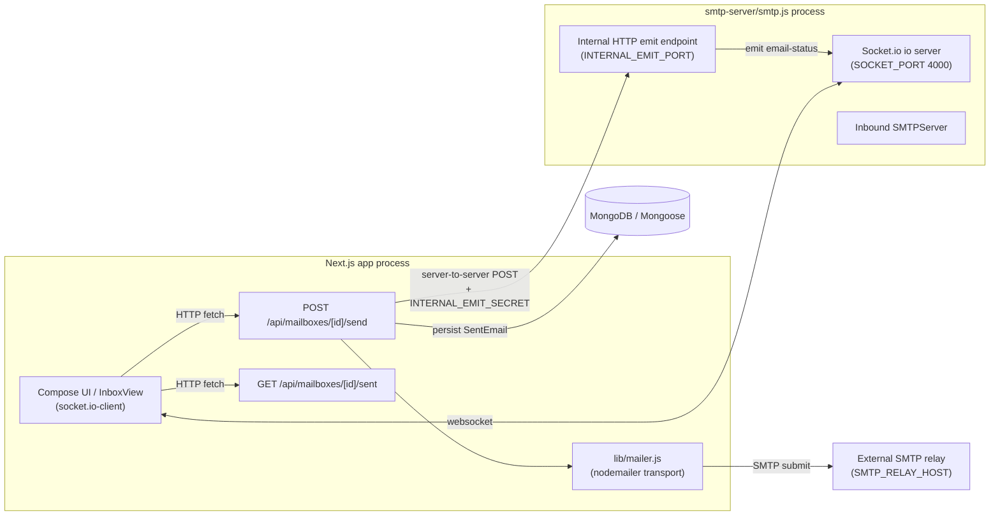
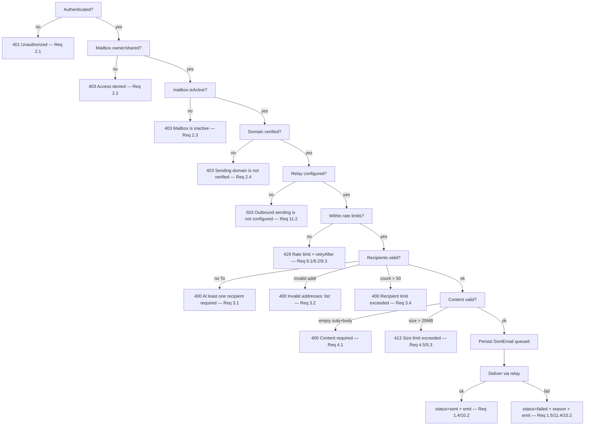
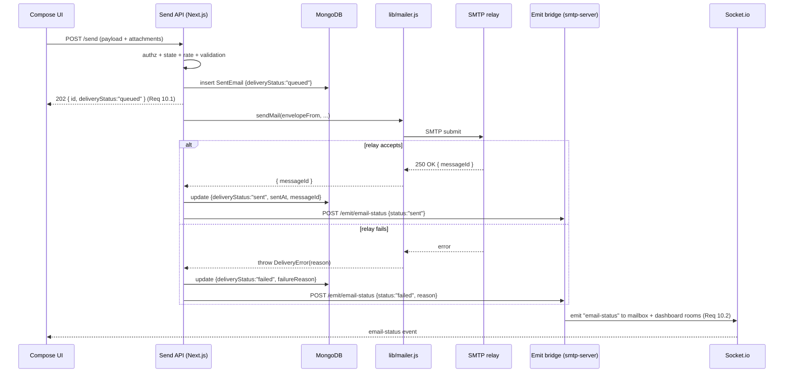

# Design Document

## Overview

This feature adds outbound email to a currently receive-only Mailbox SaaS application. An
authenticated user who owns or shares a mailbox can compose a new message, reply to a received
email, or forward one, using a mailbox address as the sender. The system validates the request,
persists a `SentEmail` record with a `queued` status, hands the message to a generic SMTP relay
via **nodemailer**, then updates the record to `sent` or `failed` and notifies the user in real
time.

The design reuses the application's established conventions:

- **Auth/access control**: `getServerSession(authOptions)` then `session.user.id`, with the
  `Mailbox.findOne({ _id, $or: [{ ownerId }, { sharedWith }] })` ownership filter.
- **Pagination**: `page`/`limit` query params, `limit` clamped to a max of 100.
- **Recipient validation**: `lib/sanitize.js#sanitizeEmail` (lowercases, regex-validates, returns
  `""` on invalid).
- **Models**: ESM default export with the `mongoose.models.X || mongoose.model(...)` guard, living
  in `lib/models/`.
- **Real-time**: the existing Socket.io rooms (`mailboxId` room and `dashboard-{userId}` room)
  already used by `components/InboxView.js` and `components/MailboxList.js`.

The key architectural constraint — and the most important design decision — is that the Socket.io
`io` server does **not** live in the Next.js process. It lives in the standalone `smtp-server/smtp.js`
process (listening on `SOCKET_PORT`, default 4000). The Next.js app is only a socket.io **client**.
Therefore the send API route cannot emit directly; this design introduces an **internal HTTP emit
bridge** so the Next.js route can ask the smtp-server process to emit a scoped real-time event
(Requirement 10.2).

### Requirements Coverage Map

| Requirement | Where addressed |
|---|---|
| 1. Compose & send new email | Send API route, `lib/mailer.js`, `SentEmail` model |
| 2. Sender authorization | Send API route — auth + ownership + `isActive` + domain `verified` checks |
| 3. Recipient validation | `validateRecipients()` helper using `sanitizeEmail` |
| 4. Content validation | `validateContent()` helper (subject cap, default subject, size cap) |
| 5. Attachments | Multipart parsing, size accounting, `SentEmail.attachments[]` |
| 6. Reply | Compose UI prefill + server `inReplyToEmailId` recording |
| 7. Forward | Compose UI + server-side source-email fetch incl. attachment buffers |
| 8. Sent storage & retrieval | `SentEmail` model + Sent list API route |
| 9. Rate limiting | `lib/send-rate-limit.js` (per-user + per-mailbox, retry-after) |
| 10. Delivery feedback & real-time | Send response payload + internal emit bridge |
| 11. Outbound delivery mechanism | `lib/mailer.js` (nodemailer relay), env config, not-configured guard |

## Architecture

### Two-Process Topology



The Next.js process owns the send pipeline and database writes. The smtp-server process owns the
`io` server. The emit bridge (server-to-server HTTP) is the only new cross-process link.

### Send Pipeline (high level)

1. Authn/authz + mailbox state checks (Req 2).
2. Relay-config presence check (Req 11.2).
3. Rate-limit check, per-user and per-mailbox (Req 9).
4. Recipient validation/normalization (Req 3).
5. Content + size validation (Req 4, Req 5).
6. For reply/forward: load the source `IncomingEmail` and derive fields (Req 6, Req 7).
7. Persist `SentEmail` with `deliveryStatus: "queued"` (Req 1.3, Req 8.1).
8. Deliver via `lib/mailer.js` (Req 11.1, Req 11.3).
9. Update record to `sent` or `failed` + `failureReason` (Req 1.4, Req 1.5, Req 11.4).
10. Fire internal emit bridge → `email-status` event (Req 10.2).
11. Return record id + status (Req 10.1).

### Deliverability / DNS — Operational Prerequisite (not auto-configured)

The relay performs the actual hand-off to recipient mail servers. For messages to pass receiver
anti-spam checks, the relay must be **authorized to send for the sending domains**: an SPF record
that includes the relay, and DKIM signing for the domain (typically configured at the relay).

The app's current `lib/dns-verify.js` only checks **MX** (inbound routing) and a **TXT
ownership token** (`mailbox-verify=<token>`). It does **not** verify SPF, DKIM, or DMARC. This
feature does **not** add SPF/DKIM provisioning and does **not** gate sending on their presence.
Treat SPF include + DKIM signing as an **operational prerequisite** documented for operators; the
feature only enforces that the domain's `verificationStatus === "verified"` (Req 2.4), which proves
ownership/inbound config, not outbound authorization.

## Components and Interfaces

### 1. `lib/mailer.js` — Outbound Delivery Agent

Wraps `nodemailer.createTransport` from relay env config. Pure delivery concern; no DB access.

```js
// Throws NotConfiguredError when relay env is incomplete (Req 11.2).
export function isRelayConfigured(): boolean

// Builds (and memoizes) the nodemailer transport from env.
// Throws NotConfiguredError if not configured.
function getTransport(): Transport

// Sends one message. Resolves { messageId } on relay acceptance,
// throws DeliveryError(reason) on failure (Req 11.4).
export async function sendMail({
  envelopeFrom,   // Sender_Mailbox.emailAddress (Req 11.3)
  from,           // header From (same address; optional display name)
  to, cc, bcc,    // string[] of normalized addresses
  subject,
  text,           // bodyText
  html,           // sanitized bodyHtml
  attachments,    // [{ filename, contentType, content: Buffer }]
}): Promise<{ messageId: string }>
```

Implementation notes:
- `createTransport({ host: SMTP_RELAY_HOST, port: SMTP_RELAY_PORT, secure: SMTP_RELAY_SECURE,
  auth: { user: SMTP_RELAY_USER, pass: SMTP_RELAY_PASS } })`.
- The `envelope.from` is set explicitly to the Sender_Mailbox address (Req 11.3); `nodemailer`
  uses `envelope` for MAIL FROM independent of the header `From`.
- Two distinct error types so the route can map them to different responses:
  - `NotConfiguredError` → HTTP 503 "Outbound sending is not configured" (Req 11.2).
  - `DeliveryError` → record `failed` + `failureReason` (Req 1.5, Req 11.4).
- **New dependency**: `nodemailer` must be added to `package.json`.

### 2. `lib/send-validation.js` — Validation Helpers

Pure functions, no I/O — directly unit/property testable.

```js
// Req 3: returns { to[], cc[], bcc[], invalid[] } with addresses lowercased.
// invalid[] lists every address (with its field) that failed sanitizeEmail.
export function validateRecipients({ to, cc, bcc })

// Req 4.2/4.3: trims subject; if empty -> "(No Subject)"; caps length at 998.
export function normalizeSubject(subject)

// Req 4.1: true when both subject (pre-default) and body are empty.
export function isContentEmpty({ subject, bodyText, bodyHtml })

// Req 4.5/5.3: sums subject+body+attachment byte sizes; true if > 25 MiB.
export function exceedsSizeLimit({ subject, bodyText, bodyHtml, attachments })

// Re/Fwd subject prefixing with dedupe (Req 6.2, 7.1).
export function prefixSubject(subject, prefix /* "Re: " | "Fwd: " */)
```

Constants: `MAX_RECIPIENTS = 50`, `MAX_SUBJECT = 998`, `MAX_TOTAL_BYTES = 25 * 1024 * 1024`.

### 3. `lib/html-sanitize.js` — Outbound HTML Sanitization

The app has no robust sanitizer (no DOMPurify); `InboxView.js` uses an inline regex `sanitizeHtml`
for *rendering* received mail. For **outbound** bodies we reuse the same conservative inline
approach, centralized into one module so both storage and delivery use the identical sanitized
string. It strips `<script>` blocks, inline `on*=` handlers, and `javascript:`/`vbscript:`/
`data:text/html` URIs before the HTML is stored in `SentEmail.bodyHtml` and passed to the relay.

```js
export function sanitizeOutboundHtml(html): string
```

This is intentionally consistent with the existing app behavior rather than introducing a new
dependency; the Testing Strategy notes a follow-up to adopt a vetted sanitizer (DOMPurify/
sanitize-html) if richer composer HTML is later allowed.

### 4. `lib/send-rate-limit.js` — Rate Limiter with retry-after

The existing `lib/rate-limit.js` rejects on limit but does **not** expose a reset time, which
Requirement 9.3 requires. Rather than change every existing caller, this feature adds a small
sibling limiter that returns the reset timestamp.

```js
// Returns { allowed: boolean, retryAfter: number /* seconds */, resetAt: number /* epoch ms */ }
export function checkSendLimit(token, { limit, windowMs }): result
```

- Two checks per send: `checkSendLimit("user:"+userId, ...)` (Req 9.1) and
  `checkSendLimit("mbx:"+mailboxId, ...)` (Req 9.2).
- Configurable via env: `SEND_RATE_USER_MAX`, `SEND_RATE_MAILBOX_MAX`, `SEND_RATE_WINDOW_MS`
  (defaults: 50/user, 100/mailbox, 3,600,000 ms).
- **Limitation (documented)**: in-memory per process. With multiple Next.js instances the limit is
  per-instance, not global. Production should back this with a shared store (Redis/Upstash). This
  mirrors the caveat already in `lib/rate-limit.js`.

### 5. Send API Route — `POST /api/mailboxes/[id]/send`

Handles new compose, reply, and forward (distinguished by an optional `mode` and
`inReplyToEmailId`/`sourceEmailId`). Orchestrates the full pipeline above. Accepts
`multipart/form-data` (for attachment uploads) with a JSON `payload` part, or `application/json`
when there are no attachments.

### 6. Sent List API Route — `GET /api/mailboxes/[id]/sent`

Returns the mailbox's `SentEmail` records, newest first, paginated, behind the same access control
(Req 8). Strips attachment `content` buffers from the list response (mirrors the inbox list).

### 7. Internal Emit Bridge (in `smtp-server/smtp.js`)

Add a small HTTP listener in the smtp-server process (the one that owns `io`). It accepts a signed
server-to-server POST from the Next.js send route and emits a scoped event.

- Listener: `INTERNAL_EMIT_PORT` (default 4001), bound to localhost.
- Auth: shared secret header `x-internal-secret: <INTERNAL_EMIT_SECRET>`; reject otherwise.
- On `POST /emit/email-status` with body `{ mailboxId, userId, payload }` it runs:
  `io.to(mailboxId).emit("email-status", payload)` and
  `io.to("dashboard-"+userId).emit("email-status", payload)`.
- Next.js side: `lib/emit-bridge.js#emitEmailStatus(...)` does a `fetch` to
  `http://127.0.0.1:INTERNAL_EMIT_PORT/emit/email-status`. Failures are swallowed (best-effort;
  the HTTP send response already carries authoritative status per Req 10.1) and logged.

**Alternative considered (documented, not chosen)**: the Next.js route connects as a
`socket.io-client` to `SOCKET_URL` and emits a relay event that the server rebroadcasts. Rejected
as primary because it adds a client connection lifecycle per request and reuses the public CORS
socket surface for privileged emits; the internal-HTTP approach keeps privileged emits on a
localhost, secret-gated channel.

### 8. Compose UI — `components/Compose.js`

A modal/panel component with To/Cc/Bcc inputs (chips), subject, a body editor (plain text with an
optional HTML toggle), and attachment upload. Mounted from `components/InboxView.js`, which gains a
"Compose" button plus per-email **Reply** and **Forward** actions in the detail view. The inbox page
(`app/dashboard/inbox/[id]/page.js`) already passes `mailboxId`, `isOwner`, and `currentUserId`;
no new props needed there.

Reply/forward prefill happens client-side from the already-loaded email (subject, from), while the
**authoritative** reply/forward derivation (including fetching attachment buffers for forward)
happens server-side so large buffers never round-trip through the browser.

## Data Models

### `SentEmail` (`lib/models/SentEmail.js`)

```js
import mongoose from "mongoose";

const SentEmailSchema = new mongoose.Schema(
  {
    mailboxId: { type: mongoose.Schema.Types.ObjectId, ref: "Mailbox", required: true, index: true },
    userId:    { type: mongoose.Schema.Types.ObjectId, ref: "User",    required: true, index: true }, // sending user (Req 8.1)
    from:      { type: String, required: true },     // Sender_Mailbox.emailAddress (Req 1.2)
    to:        { type: [String], default: [] },      // normalized, lowercased (Req 3.5)
    cc:        { type: [String], default: [] },
    bcc:       { type: [String], default: [] },
    subject:   { type: String, default: "(No Subject)" }, // (Req 4.3)
    bodyHtml:  { type: String, default: "" },         // sanitized (Req 4.4)
    bodyText:  { type: String, default: "" },
    attachments: [
      {
        filename:    String,
        contentType: String,
        size:        Number,
        content:     Buffer, // stored for sent history / resend (Req 5.2)
      },
    ],
    deliveryStatus: { type: String, enum: ["queued", "sent", "failed"], default: "queued", index: true }, // (Req 1.3–1.5)
    failureReason:  { type: String, default: "" },   // (Req 1.5, 11.4)
    inReplyToEmailId: { type: mongoose.Schema.Types.ObjectId, ref: "IncomingEmail", default: null }, // (Req 6.4)
    messageId: { type: String, default: "" },        // relay-assigned id (Req 10.1 correlation)
    sentAt:    { type: Date, default: null },         // set when status -> sent
  },
  { timestamps: true } // createdAt = queued time
);

SentEmailSchema.index({ mailboxId: 1, createdAt: -1 }); // sent list, newest first (Req 8.2, 8.4)

export default mongoose.models.SentEmail || mongoose.model("SentEmail", SentEmailSchema);
```

**Decision — NO TTL on SentEmail.** `IncomingEmail` carries a 3-day TTL
(`expireAfterSeconds: 60*60*24*3`). Sent history must **persist**, so `SentEmail` deliberately omits
any TTL index. This is called out explicitly because of a **schema-drift risk**: the smtp-server
process redefines a trimmed `IncomingEmailSchema` inline and must keep its TTL in sync with
`lib/models/IncomingEmail.js`. `SentEmail` has no such inline duplicate (it is only written from the
Next.js process), so there is no second definition to drift — but any future code that writes
SentEmail from the smtp-server process must **not** add a TTL.

### Reused models

- `Mailbox` — ownership (`ownerId`, `sharedWith`), `isActive`, `domainId`, `emailAddress`.
- `Domain` — `verificationStatus` gate for sending (Req 2.4).
- `IncomingEmail` — source for reply/forward; note the list endpoint strips
  `attachments.content`, so forward must re-fetch the full document server-side.

### Validation Flow Ordering (Send route)

The order matters so that the most authoritative / cheapest rejections happen first and error
messages are deterministic:



### Queued → Sent/Failed Sequence



Note: the route returns `queued` immediately (Req 10.1); the final state reaches the UI via the
real-time event (Req 10.2). The route may instead await delivery and return the final status — both
satisfy Req 10.1 since the response always identifies the record and *a* current status. This design
returns promptly and relies on the event for the terminal state, keeping the request fast under
relay latency.

## API Contracts

### `POST /api/mailboxes/[id]/send`

Request (`application/json`, or `multipart/form-data` with a `payload` JSON part + file parts):

```json
{
  "to": ["alice@example.com"],
  "cc": [],
  "bcc": [],
  "subject": "Hello",
  "bodyText": "Hi there",
  "bodyHtml": "<p>Hi there</p>",
  "mode": "new",                 // "new" | "reply" | "forward"
  "sourceEmailId": null          // required for reply/forward; recorded as inReplyToEmailId on reply
}
```

Success — `202 Accepted`:

```json
{
  "sentEmail": {
    "_id": "…",
    "mailboxId": "…",
    "from": "me@mydomain.com",
    "to": ["alice@example.com"],
    "subject": "Hello",
    "deliveryStatus": "queued"
  }
}
```

Error responses (each maps to a rejection requirement):

| Status | `error` message | Requirement |
|---|---|---|
| 401 | `Unauthorized` | 2.1 |
| 403 | `Mailbox not found or access denied` | 2.2 |
| 403 | `Mailbox is inactive` | 2.3 |
| 403 | `Sending domain is not verified` | 2.4 |
| 400 | `At least one recipient is required` | 3.1 |
| 400 | `Invalid recipient address(es)` + `invalid: [{field, value}]` | 3.2 |
| 400 | `Recipient limit of 50 exceeded` | 3.4 |
| 400 | `Message content is required` | 4.1 |
| 413 | `Message exceeds the 25MB size limit` | 4.5 / 5.3 |
| 429 | `Rate limit exceeded` + `retryAfter` (seconds) | 9.1 / 9.2 / 9.3 |
| 503 | `Outbound sending is not configured` | 11.2 |

All rejections return a human-readable `error` identifying the reason (Req 10.3).

### `GET /api/mailboxes/[id]/sent?page=1&limit=30`

Success — `200`:

```json
{ "sent": [ /* SentEmail without attachments.content */ ], "total": 12, "page": 1, "limit": 30 }
```

- `limit` clamped to `[1, 100]` (Req 8.5); sorted `createdAt: -1` (Req 8.4); filtered by
  `mailboxId` (Req 8.2) behind owner/shared access control (Req 8.3 → 404/403 with no records).

### Real-time event `email-status`

Emitted to the `mailboxId` room and `dashboard-{userId}` room (Req 10.2):

```json
{
  "sentEmailId": "…",
  "mailboxId": "…",
  "deliveryStatus": "sent",     // or "failed"
  "failureReason": "",          // populated when failed
  "subject": "Hello",
  "to": ["alice@example.com"],
  "sentAt": "2025-01-01T00:00:00.000Z"
}
```

`components/InboxView.js` subscribes alongside its existing `new-email` handler:
`socket.on("email-status", (e) => { /* update sent-status toast / sent list */ })`, after the
existing `socket.emit("join-mailbox", mailboxId)`.

## Environment / Configuration Additions

| Env key | Purpose | Process |
|---|---|---|
| `SMTP_RELAY_HOST` | Relay hostname | Next.js |
| `SMTP_RELAY_PORT` | Relay port (e.g. 587) | Next.js |
| `SMTP_RELAY_USER` | Relay auth user | Next.js |
| `SMTP_RELAY_PASS` | Relay auth password | Next.js |
| `SMTP_RELAY_SECURE` | `true` for implicit TLS (465), else STARTTLS | Next.js |
| `INTERNAL_EMIT_SECRET` | Shared secret for the emit bridge | both |
| `INTERNAL_EMIT_PORT` | Localhost port for emit bridge (default 4001) | both |
| `SEND_RATE_USER_MAX` | Max sends/user/window (default 50) | Next.js |
| `SEND_RATE_MAILBOX_MAX` | Max sends/mailbox/window (default 100) | Next.js |
| `SEND_RATE_WINDOW_MS` | Rate window ms (default 3,600,000) | Next.js |

"Required relay configuration" for Req 11.2 = `SMTP_RELAY_HOST` + `SMTP_RELAY_PORT` present (with
`SMTP_RELAY_USER`/`SMTP_RELAY_PASS` if the relay requires auth). `lib/mailer.js#isRelayConfigured`
encodes this check.

## Correctness Properties

*A property is a characteristic or behavior that should hold true across all valid executions of a
system — essentially, a formal statement about what the system should do. Properties serve as the
bridge between human-readable specifications and machine-verifiable correctness guarantees.*

PBT applies here because the send pipeline's core logic lives in **pure
functions** — recipient validation/normalization, subject normalization, content/size accounting,
subject-prefix dedupe, query filtering/ordering/clamping, and the in-memory rate limiter. These have
large input spaces and clear universal invariants. The relay delivery, cross-process socket emit,
auth branches, and DB I/O are not property-tested (they are example/integration tests — see Testing
Strategy). The properties below were derived from the prework analysis, with redundant criteria
consolidated.

### Property 1: Sender identity is always the mailbox address

*For any* compose payload (including one whose client-supplied `from` is spoofed or absent), the
`SentEmail.from` that is persisted and the envelope sender (`envelopeFrom`) passed to the delivery
agent both equal the Sender_Mailbox `emailAddress`.

**Validates: Requirements 1.2, 11.3**

### Property 2: Recipient validation identifies invalids and normalizes the rest

*For any* set of To/Cc/Bcc address lists, `validateRecipients` returns an `invalid` collection equal
to exactly the subset of inputs for which `sanitizeEmail` returns `""`, and every remaining
(accepted) address equals its lowercased `sanitizeEmail` output. When no input is invalid, the
request is allowed to proceed.

**Validates: Requirements 3.2, 3.3, 3.5**

### Property 3: Recipient count limit

*For any* combination of To/Cc/Bcc lists, the request is rejected for exceeding the recipient limit
if and only if the combined count of To + Cc + Bcc is greater than 50.

**Validates: Requirements 3.4**

### Property 4: Subject normalization

*For any* subject input, the normalized subject is exactly `"(No Subject)"` when the input is empty
or whitespace-only, and otherwise has length less than or equal to 998 characters.

**Validates: Requirements 4.2, 4.3**

### Property 5: Empty-content detection

*For any* combination of subject, `bodyText`, and `bodyHtml`, `isContentEmpty` is true if and only
if the subject is empty/whitespace AND both body fields are empty/whitespace.

**Validates: Requirements 4.1**

### Property 6: Total size limit accounting

*For any* combination of subject, body, and attachment byte sizes, the request is rejected for size
if and only if the summed total exceeds 25 MiB (26,214,400 bytes).

**Validates: Requirements 4.5, 5.3**

### Property 7: Attachment metadata preservation

*For any* list of attachments provided to the send pipeline, each stored `SentEmail.attachments[]`
entry preserves the corresponding input `filename`, `contentType`, and `size`.

**Validates: Requirements 5.2**

### Property 8: Reply/forward subject prefixing is single and idempotent

*For any* subject string and prefix in {`"Re: "`, `"Fwd: "`}, `prefixSubject` produces a subject that
begins with exactly one instance of that prefix (no double-prefixing when the input already begins
with it), and applying the function again leaves the result unchanged (`f(f(x)) == f(x)`).

**Validates: Requirements 6.2, 7.1**

### Property 9: Sent retrieval is scoped to the mailbox

*For any* database state containing `SentEmail` records across multiple mailboxes, the records
returned by the sent-list query for a given mailbox all have a `mailboxId` equal to the requested
mailbox.

**Validates: Requirements 8.2**

### Property 10: Sent retrieval ordering

*For any* set of `SentEmail` records, the sent-list results are ordered by `createdAt` from most
recent to least recent (non-increasing).

**Validates: Requirements 8.4**

### Property 11: Pagination clamp

*For any* requested `limit` value (including missing, zero, negative, or very large), the effective
page size is clamped to the range [1, 100], and the number of returned records never exceeds 100.

**Validates: Requirements 8.5**

### Property 12: Rate-limit counting

*For any* token (user or mailbox) and configured limit `N`, the first `N` send checks within a
window are allowed and every subsequent check within the same window is rejected.

**Validates: Requirements 9.1, 9.2**

### Property 13: Retry-after on rate-limit rejection

*For any* rate-limit rejection, the returned `retryAfter` is greater than 0 and less than or equal
to the configured window length (in seconds).

**Validates: Requirements 9.3**

## Error Handling

The send route uses a single ordered validation gate (see "Validation Flow Ordering"). Each gate
returns a structured JSON error `{ error: <message>, ...detail }` with the status code from the API
Contracts table. Principles:

- **Fail fast, deterministic order**: auth → access → mailbox state → relay config → rate limit →
  recipients → content/size. This guarantees a single, predictable error per request and makes
  Property/example tests stable.
- **Identify the reason** (Req 10.3): every rejection carries a human-readable `error`. Recipient
  format failures additionally return `invalid: [{ field, value }]` so the UI can highlight each bad
  address (Req 3.2).
- **Not-configured vs delivery failure** are distinct: `NotConfiguredError` from `lib/mailer.js`
  surfaces as `503` *before* any record is created (Req 11.2); a `DeliveryError` occurs *after* the
  `queued` record exists and transitions it to `failed` with `failureReason` (Req 1.5, 11.4).
- **Delivery failures are not request failures**: once a `queued` record is persisted and the request
  is accepted (`202`), a subsequent relay failure does not throw to the client — it is recorded on the
  record and pushed via the `email-status` event. This keeps Req 10.1 (immediate status) and Req 10.2
  (terminal status) cleanly separated.
- **Emit bridge is best-effort**: failures contacting the smtp-server emit endpoint are caught and
  logged; they never fail the send or corrupt the persisted status (the DB is the source of truth,
  and `GET /sent` reflects the real state).
- **Attachment/body parsing errors** (malformed multipart, oversized stream) return `400`/`413`
  without creating a record.
- **Unexpected errors** are caught at the route boundary and returned as `500 Server error`, matching
  the existing route convention.

## Testing Strategy

### Dual approach

- **Property-based tests** verify the universal invariants above across many generated inputs.
- **Example/unit tests** verify specific branches, state transitions, and response shapes.
- **Integration tests** verify the relay hand-off and the cross-process emit bridge.

### Property-based testing

- Library: **fast-check** (already present in `devDependencies`) with **Jest** (already configured).
- Each of Properties 1–13 is implemented as a **single** property test running a **minimum of 100
  iterations** (fast-check default ≥ 100; set `{ numRuns: 100 }` explicitly).
- Each property test is tagged with a comment referencing the design property, format:
  `// Feature: send-email, Property {number}: {property_text}`.
- Targets are the pure helpers in `lib/send-validation.js`, `lib/send-rate-limit.js`, and the
  pure record-building / query-shaping functions extracted from the routes. Database-touching
  properties (9, 10) test the query-building/sorting/clamping logic against an in-memory array model
  or `mongodb-memory-server` so 100+ iterations stay cheap.
- Generators of note: mixed-case and malformed email strings (to exercise Property 2), recipient
  list sizes spanning the 50 boundary (Property 3), subjects spanning the 998 boundary and
  whitespace-only strings (Properties 4, 5), attachment size arrays straddling 25 MiB
  (Property 6), and subjects with zero, one, or repeated `Re: `/`Fwd: ` prefixes (Property 8).

### Example / unit tests

Cover the criteria classified as EXAMPLE/EDGE_CASE in prework, using mocks for the mailer and emit
bridge:

- Auth/access/state branches: unauthenticated → 401 (2.1); non-owner → 403 (2.2); inactive mailbox
  (2.3); unverified domain (2.4).
- Pipeline ordering and transitions: `queued` created before delivery (1.3); success → `sent`
  (1.4); failure → `failed` + reason (1.5, 11.4); response shape carries id + status (10.1); every
  rejection returns a non-empty `error` (10.3).
- Empty To list → rejection (edge case for 3.1).
- Reply prefill/derivation (6.1, 6.3), `inReplyToEmailId` recorded (6.4); forward body inclusion
  (7.2) and server-side attachment-buffer inclusion (7.3).
- Relay not configured → 503 (11.2).
- Body acceptance variants: text-only, html-only, both (4.4).
- Outbound HTML sanitization: `sanitizeOutboundHtml` strips `<script>`, `on*=` handlers, and
  `javascript:`/`data:text/html` URIs before storage/delivery.

### Integration tests

- Relay delivery (11.1) against a test SMTP sink (e.g. a throwaway nodemailer test account or a
  local smtp-server instance), asserting envelope sender equals the mailbox address (1–3 examples,
  not property-based — external/slow).
- Emit bridge (10.2): with the smtp-server emit endpoint running, assert that a terminal status
  transition results in an `email-status` event delivered to the `mailboxId` and `dashboard-{userId}`
  rooms with the documented payload. Verified with 1–2 representative cases; the secret-gating
  (reject without `INTERNAL_EMIT_SECRET`) is a smoke check.

### Follow-up note

The outbound HTML sanitizer reuses the app's existing conservative inline approach. If the composer
later supports richer user HTML, adopt a vetted sanitizer (DOMPurify/`sanitize-html`) and add
property tests asserting that sanitization is idempotent and removes all active content.
