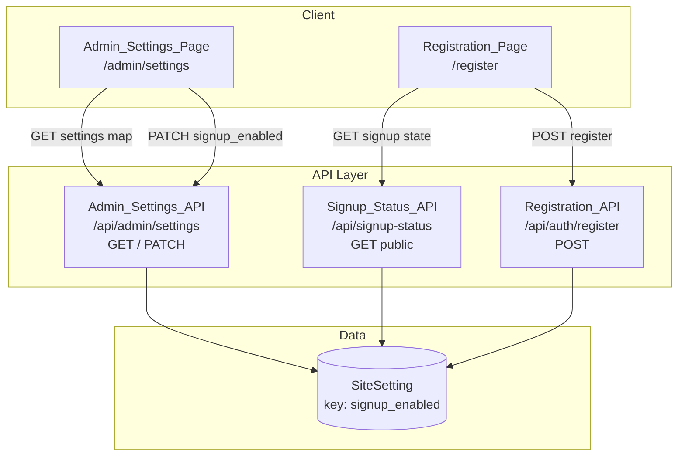
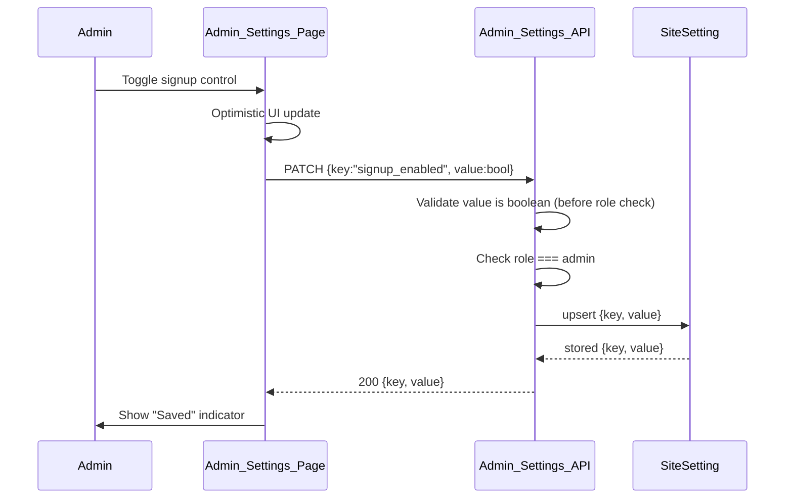
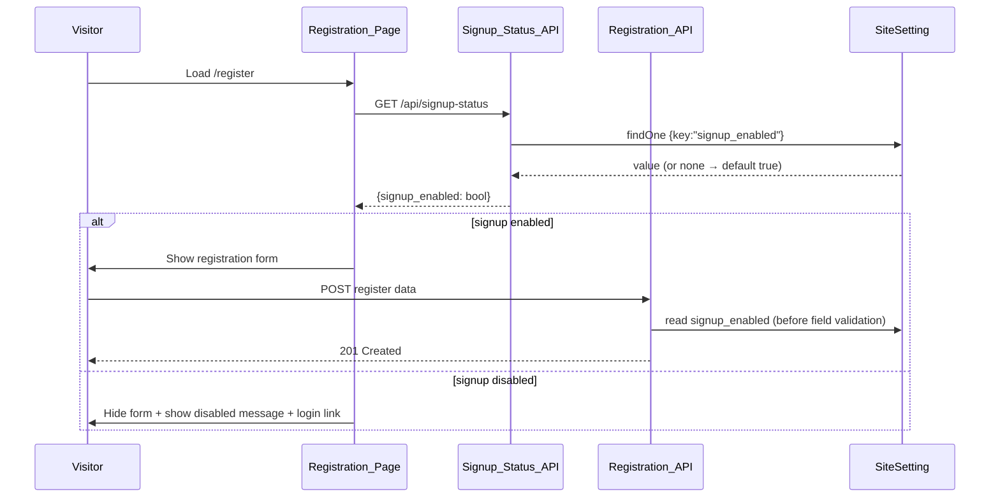

# Design Document: Signup Toggle

## Overview

এই ফিচারটি অ্যাডমিনকে সাইট-ব্যাপী একটি বুলিয়ান সেটিং (`signup_enabled`) দিয়ে নতুন ইউজার রেজিস্ট্রেশন চালু/বন্ধ করার নিয়ন্ত্রণ দেয়। এটি বিদ্যমান `SiteSetting` মডেল ও অ্যাডমিন সেটিংস ইনফ্রাস্ট্রাকচারের উপরে নির্মিত, এবং চারটি জায়গায় enforce করা হয়:

1. **Admin_Settings_API** (`/api/admin/settings`) — `signup_enabled` কে একটি পরিচিত (known) সেটিং হিসেবে যুক্ত করা, বুলিয়ান ভ্যালিডেশন সহ।
2. **Admin_Settings_Page** (`/admin/settings`) — অ্যাডমিনের জন্য একটি toggle কন্ট্রোল।
3. **Registration_API** (`/api/auth/register`) — সাইন-আপ বন্ধ থাকলে রেজিস্ট্রেশন প্রত্যাখ্যান।
4. **Registration_Page** (`/register`) — সাইন-আপ অবস্থা অনুযায়ী ফর্ম দেখানো/লুকানো।

একটি নতুন পাবলিক **Signup_Status_API** (`/api/signup-status`) যোগ করা হবে যাতে লগআউট অবস্থায় থাকা Visitor-ও অ্যাডমিন অথেন্টিকেশন ছাড়াই সাইন-আপ অবস্থা পড়তে পারে।

### Design Goals

- বিদ্যমান `SiteSetting` কী-ভ্যালু প্যাটার্ন পুনঃব্যবহার করা (নতুন মডেল নয়)।
- একটি single source of truth: `signup_enabled` কী, ডিফল্ট `true`।
- পাবলিক পঠনযোগ্যতা শুধুমাত্র `signup_enabled` মানে সীমাবদ্ধ রাখা — অন্য কোনো সেটিং leak না করা।
- বিদ্যমান কোড কনভেনশনের (NextResponse, getServerSession, dbConnect) সাথে সামঞ্জস্য রাখা।

### Key Design Decision: Validation Order

Requirement 1.4 অনুযায়ী Admin_Settings_API কে role চেক করার **আগেই** ভ্যালুর ডেটা টাইপ ভ্যালিডেট করতে হবে। বর্তমান `route.js` প্রথমে role চেক করে। তাই PATCH হ্যান্ডলারে লজিকের ক্রম পুনর্বিন্যাস করা হবে:

1. কী পার্স ও ভ্যালিডেট করা (পরিচিত কী কিনা)।
2. কী-নির্দিষ্ট ভ্যালু টাইপ ভ্যালিডেশন (`signup_enabled` এর জন্য boolean) → ব্যর্থ হলে `400`, এমনকি non-admin রিকোয়েস্টের জন্যও।
3. এরপর role চেক → admin না হলে `403`।
4. পারসিস্ট ও রেসপন্স।

এই reordering শুধুমাত্র টাইপ-লেভেল ভ্যালিডেশনের জন্য প্রযোজ্য; এটি একটি সচেতন ডিজাইন সিদ্ধান্ত যা requirement 1.5 (non-boolean → 400 including non-admin) ও 1.6 (valid value + non-admin → 403) কে আলাদা করে।

## Architecture



### Request Flows

**Admin toggles signup (Requirement 1, 2):**


**Visitor loads register page (Requirement 3, 4, 5):**


## Components and Interfaces

### 1. SiteSetting registry update (Admin_Settings_API)

`app/api/admin/settings/route.js` এর `SETTINGS` রেজিস্ট্রিতে `signup_enabled` যোগ করা হবে:

```js
const SETTINGS = {
  docs_visibility: { default: "public", allowed: [...] },
  signup_enabled: { default: true, type: "boolean" },
};
```

একটি নতুন ভ্যালিডেশন helper যুক্ত হবে যা `def.type === "boolean"` হলে `typeof value === "boolean"` যাচাই করে।

**GET `/api/admin/settings`** (পরিবর্তিত আচরণ)
- ইনপুট: কোনো বডি নয়; অথেন্টিকেটেড অ্যাডমিন সেশন প্রয়োজন।
- আউটপুট: সব পরিচিত সেটিংয়ের map, ডিফল্ট দিয়ে seed করা এবং stored value দিয়ে override করা। `signup_enabled` map-এ অন্তর্ভুক্ত থাকবে (Requirement 1.2)। কোনো stored value না থাকলে ডিফল্ট `true` (Requirement 1.3)।
- ত্রুটি: non-admin → `403`; সার্ভার ত্রুটি → `500`।

**PATCH `/api/admin/settings`** (reordered logic — Requirement 1.4, 1.5, 1.6)
- ইনপুট: `{ key: string, value: any }`।
- প্রসেসিং ক্রম:
  1. বডি পার্স; `key` স্ট্রিং কিনা ও পরিচিত কিনা যাচাই → না হলে `400`।
  2. কী-নির্দিষ্ট টাইপ ভ্যালিডেশন: `signup_enabled` এর ভ্যালু boolean না হলে `400` (role নির্বিশেষে)।
  3. role !== `admin` হলে `403`।
  4. `SiteSetting.findOneAndUpdate({key},{key,value},{upsert:true})`।
- আউটপুট: `200 { key, value }` (Requirement 1.1)।

### 2. Signup_Status_API (new, public)

ফাইল: `app/api/signup-status/route.js` (পাবলিক, `/api/docs-access` প্যাটার্ন অনুসরণে)।

**GET `/api/signup-status`**
- ইনপুট: কোনো অথেন্টিকেশন নয়।
- প্রসেসিং: `SiteSetting.findOne({ key: "signup_enabled" })`। স্পষ্টভাবে শুধু এই একটি কী query করা হয় যাতে অন্য সেটিং অন্তর্ভুক্ত না হয় (Requirement 5.2)।
- আউটপুট: `{ signup_enabled: boolean }`। stored value না থাকলে বা boolean না হলে `true` (Requirement 5.4)।
- সুরক্ষা: রেসপন্স অবজেক্টে শুধুমাত্র `signup_enabled` ফিল্ড থাকবে। কোনো কারণে অতিরিক্ত ফিল্ড অন্তর্ভুক্ত হলে error লগ করে শুধু `signup_enabled` ফেরত দেওয়া হবে (Requirement 5.3)।

```js
export const dynamic = "force-dynamic";
// GET → { signup_enabled: boolean }
```

### 3. Registration_API enforcement

ফাইল: `app/api/auth/register/route.js` (পরিবর্তিত)।

- rate-limit চেকের পর, ইনপুট ফিল্ড ভ্যালিডেশনের **আগে** (Requirement 3.4) `signup_enabled` পড়া হবে:
  ```js
  const setting = await SiteSetting.findOne({ key: "signup_enabled" }).lean();
  const signupEnabled = typeof setting?.value === "boolean" ? setting.value : true;
  if (!signupEnabled) {
    return NextResponse.json(
      { error: "Signup is currently disabled by the administrator." },
      { status: 403 }
    );
  }
  ```
- সাইন-আপ enabled হলে বিদ্যমান প্রবাহ অপরিবর্তিত — valid ইনপুটে `201` (Requirement 3.1)।
- disabled হলে `403` + বর্ণনামূলক বার্তা, এবং কোনো ইউজার তৈরি হয় না (Requirement 3.2, 3.3)।

### 4. Admin_Settings_Page UI

ফাইল: `app/admin/settings/page.js` (পরিবর্তিত)।

- প্রাথমিক state-এ `signup_enabled: true` যোগ করা; `fetchSettings` ইতিমধ্যে map merge করে তাই বর্তমান মান দেখানো হবে (Requirement 2.1)।
- একটি নতুন কার্ড + toggle (enable/disable) কন্ট্রোল। বিদ্যমান `updateSetting(key, value)` helper পুনঃব্যবহার করা হবে:
  - Enable → `updateSetting("signup_enabled", true)` (Requirement 2.2)।
  - Disable → `updateSetting("signup_enabled", false)` (Requirement 2.3)।
- বিদ্যমান optimistic-update প্যাটার্ন: সফল হলে "Saved" indicator (Requirement 2.4); ব্যর্থ হলে error দেখানো ও পূর্বের state পুনঃস্থাপন (Requirement 2.5)।

### 5. Registration_Page UI

ফাইল: `app/(auth)/register/page.js` (পরিবর্তিত)।

- মাউন্টে `GET /api/signup-status` কল করা (Requirement 4.1)।
- লোডিং অবস্থায় spinner; এরপর:
  - `signup_enabled === true` → বিদ্যমান ফর্ম দেখানো (Requirement 4.2)।
  - `signup_enabled === false` → ফর্ম লুকানো, "signup currently disabled" বার্তা ও `/login` লিঙ্ক দেখানো; ফর্ম submit সম্ভব নয় (Requirement 4.3, 4.4, 4.5)।

## Data Models

কোনো নতুন মডেল নেই। বিদ্যমান `SiteSetting` কী-ভ্যালু ডকুমেন্ট ব্যবহার করা হয়:

```js
// lib/models/SiteSetting.js (unchanged)
{
  key: String,      // "signup_enabled"
  value: Mixed,     // boolean true | false
  createdAt, updatedAt
}
```

**Signup setting document**

| Field | Type | Value |
|-------|------|-------|
| `key` | String (unique) | `"signup_enabled"` |
| `value` | Boolean | `true` (enabled) / `false` (disabled) |

**Default semantics:** কোনো ডকুমেন্ট না থাকলে কার্যকর মান `true` (Requirement 1.3, 5.4)। ভ্যালু boolean না হলে (অবৈধ stored data) কার্যকর মান `true` ধরা হয়।

**API response shapes**

```jsonc
// GET /api/admin/settings (admin only)
{ "docs_visibility": "public", "signup_enabled": true }

// PATCH /api/admin/settings (admin only)
{ "key": "signup_enabled", "value": false }

// GET /api/signup-status (public)
{ "signup_enabled": true }

// POST /api/auth/register when disabled
{ "error": "Signup is currently disabled by the administrator." }  // 403
```

## Correctness Properties

*একটি property হলো এমন একটি বৈশিষ্ট্য বা আচরণ যা সিস্টেমের সব বৈধ execution জুড়ে সত্য থাকা উচিত — মূলত সিস্টেমের কী করা উচিত সে সম্পর্কে একটি আনুষ্ঠানিক বিবৃতি। Properties মানব-পঠনযোগ্য স্পেসিফিকেশন ও মেশিন-যাচাইযোগ্য correctness গ্যারান্টির মধ্যে সেতু হিসেবে কাজ করে।*

এই ফিচারে PBT সীমিতভাবে প্রযোজ্য: সেটিং resolution (boolean coercion + default), ভ্যালু ভ্যালিডেশন, রেজিস্ট্রেশন গেট, এবং পাবলিক রেসপন্স আইসোলেশন — এগুলো বিশুদ্ধ লজিক যা ইনপুট পরিবর্তনের সাথে অর্থপূর্ণভাবে পরিবর্তিত হয়। UI রেন্ডারিং ও নির্দিষ্ট-দৃষ্টান্ত আচরণগুলো example/integration টেস্টে রাখা হয়েছে।

### Property 1: Setting resolution round-trip and default

*For any* boolean value `b` (অথবা সংরক্ষিত মানের অনুপস্থিতি), `signup_enabled` কে `b` হিসেবে সংরক্ষণ করার পর Admin_Settings_API (GET) এবং Signup_Status_API (GET) উভয়ই `b` ফেরত দেবে; কোনো মান সংরক্ষিত না থাকলে (বা মান boolean না হলে) উভয়ই `true` ফেরত দেবে।

**Validates: Requirements 1.1, 1.3, 5.1, 5.4**

### Property 2: Non-boolean values are rejected

*For any* JSON মান `v` যা boolean নয় (string, number, null, object, array সহ), Admin_Settings_API-তে `{ key: "signup_enabled", value: v }` সহ PATCH রিকোয়েস্ট HTTP `400` ফেরত দেবে — রিকোয়েস্টকারীর role নির্বিশেষে।

**Validates: Requirements 1.4, 1.5**

### Property 3: Disabled signup blocks all registrations

*For any* রেজিস্ট্রেশন payload (বৈধ বা অবৈধ ফিল্ড সহ), যখন `signup_enabled` মিথ্যা (disabled), তখন Registration_API HTTP `403` ফেরত দেবে এবং কোনো নতুন ইউজার অ্যাকাউন্ট তৈরি হবে না (মোট ইউজার সংখ্যা অপরিবর্তিত থাকবে)।

**Validates: Requirements 3.2, 3.4**

### Property 4: Public status response is isolated

*For any* সংরক্ষিত site settings-এর সংগ্রহ (অন্যান্য কী সহ), Signup_Status_API-এর রেসপন্স অবজেক্টে ঠিক একটিই কী থাকবে — `signup_enabled` — এবং অন্য কোনো সেটিং কী leak হবে না।

**Validates: Requirements 5.2**

## Error Handling

| পরিস্থিতি | আচরণ | Requirement |
|-----------|------|-------------|
| PATCH `signup_enabled` non-boolean value | `400 { error }`, role চেকের আগে | 1.4, 1.5 |
| PATCH/GET settings by non-admin (valid value) | `403 { error: "Unauthorized" }` | 1.6 |
| Admin_Settings_API DB/সার্ভার ত্রুটি | `500 { error: "Server error" }`, লগ | — |
| Settings page update ব্যর্থ | error বার্তা + পূর্বের state পুনঃস্থাপন (optimistic rollback) | 2.5 |
| Register যখন signup disabled | `403` + বর্ণনামূলক বার্তা, কোনো ইউজার তৈরি নয় | 3.2, 3.3 |
| Register rate limit অতিক্রম | বিদ্যমান `429` আচরণ অপরিবর্তিত | — |
| Signup_Status_API-তে অপ্রত্যাশিত অতিরিক্ত ফিল্ড | error লগ করে শুধু `signup_enabled` ফেরত | 5.3 |
| Signup_Status_API DB ত্রুটি | `500`; নিরাপদ ফলব্যাক হিসেবে register page enabled=true ধরে spinner-পরবর্তী state নির্ধারণ করবে | — |
| অবৈধ/অনুপস্থিত stored value | কার্যকর মান `true` (default coercion) | 1.3, 5.4 |

**ফলব্যাক নীতি:** Registration_Page যদি Signup_Status_API থেকে স্পষ্ট `false` না পায়, তবে এটি ফর্ম দেখাবে (fail-open UI), কারণ চূড়ান্ত enforcement সর্বদা Registration_API-তে server-side হয়।

## Testing Strategy

### Dual Approach

- **Property-based tests** — উপরের ৪টি correctness property, প্রতিটি ন্যূনতম **১০০ iteration** চালাবে।
- **Unit / example tests** — নির্দিষ্ট দৃষ্টান্ত, UI আচরণ, ও edge case।
- **Integration tests** — endpoint-level প্রবাহ (auth gating, DB persistence)।

### Property-Based Testing

- লাইব্রেরি: JavaScript/Next.js পরিবেশের জন্য **fast-check** (নিজস্ব ফ্রেমওয়ার্ক নয়)। টেস্ট রানার হিসেবে প্রকল্পের বিদ্যমান সেটআপ (Jest/Vitest) ব্যবহার।
- প্রতিটি property test ন্যূনতম ১০০ iteration চালাবে এবং নিচের ফরম্যাটে ট্যাগ থাকবে:
  `// Feature: signup-toggle, Property {number}: {property_text}`
- বাহ্যিক নির্ভরতা (MongoDB, getServerSession) mock করা হবে যাতে বিশুদ্ধ লজিক দ্রুত ও খরচ-সাশ্রয়ীভাবে যাচাই করা যায়।

| Property | Generator | যাচাই |
|----------|-----------|-------|
| P1 | boolean ও absent state | set→get fidelity, default true |
| P2 | arbitrary non-boolean JSON (string/number/null/obj/array) | প্রতিটিতে `400` |
| P3 | arbitrary register payloads (valid + malformed) | disabled অবস্থায় `403`, user count অপরিবর্তিত |
| P4 | arbitrary collection of other SiteSetting docs | রেসপন্স কী === `{ signup_enabled }` |

### Example / Unit Tests

- GET settings map-এ `signup_enabled` উপস্থিত (1.2)।
- Validation-order: non-admin + non-boolean → 400; non-admin + boolean → 403 (1.4, 1.6)।
- Register: enabled + valid → 201 (3.1); disabled message বিষয়বস্তু (3.3)।
- Signup_Status_API: empty store → `true` (5.4); 5.3 forced-extra-field path লগিং।

### Component (UI) Tests

- Admin_Settings_Page: বর্তমান state রেন্ডার (2.1); enable→PATCH true (2.2); disable→PATCH false (2.3); success→"Saved" (2.4); failure→error + rollback (2.5)।
- Registration_Page: মাউন্টে status fetch (4.1); enabled→form দৃশ্যমান (4.2); disabled→form লুকানো (4.3), disabled বার্তা (4.4), login লিঙ্ক (4.5)।

### Integration Tests

- Admin auth gating end-to-end (admin বনাম non-admin)।
- Register API + SiteSetting persistence: toggle off → register 403 → toggle on → register 201।
